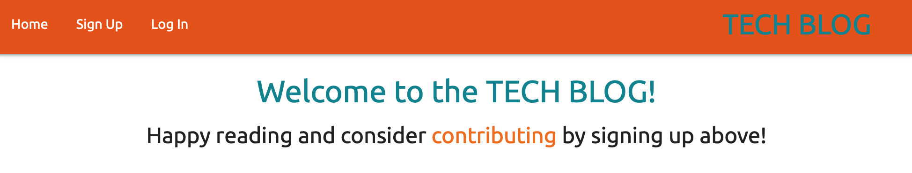
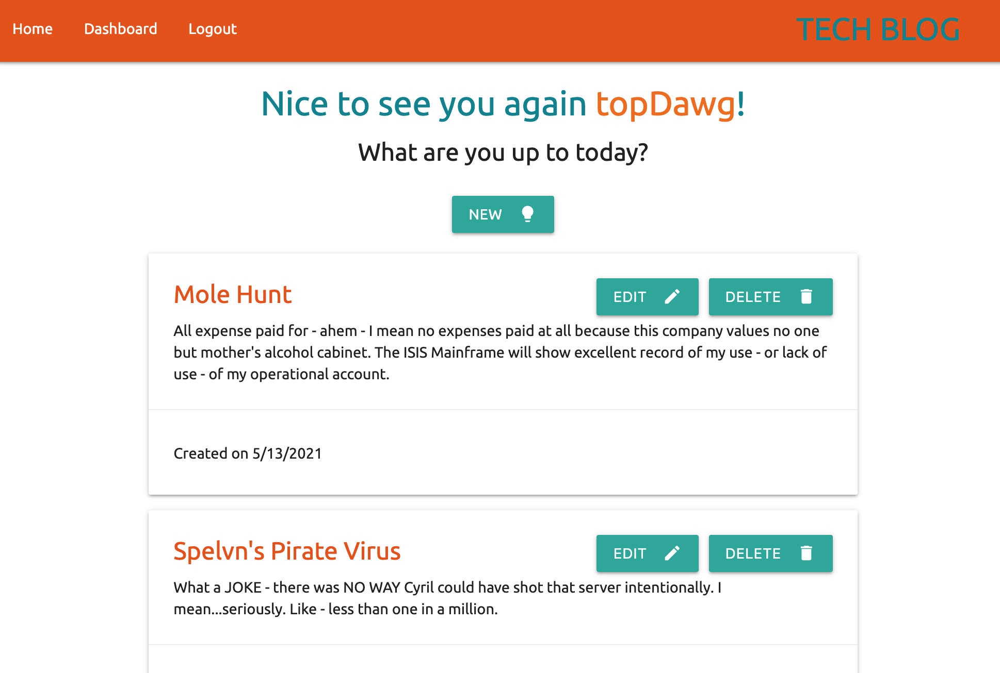

# TECH BLOG - MVC paradigm  

## Table of Contents
- [Project Overview](#Project-Overview)
- [MVP](#MVP)
- [Installation](#Installation)
- [Usage](#Usage)
- [Application Screenshots](#Application-Screenshots)
- [Deployment](#Deployment)
- [License](#License)
- [Credit](#Credit)

****

## Project Overview

A tech blog featuring the Model-View-Controller paradigm using Handlebars and Sequelize.

### Project Status:

*COMPLETED*

#### Issues to debug:

*  *SQL randomizing user-seeds everytime `npm run seed` >> Has to do with .bulkCreate : can use .create and loop to initiate hooks*

* `Uncaught TypeError: Cannot read property 'addEventListener' of null for several scripts > **RESOLVED**

* Log In button on modal not functioning: frontend JS > **RESOLVED**

* Create post button not functioning: frontend JS >  **RESOLVED**

* EDIT/DELETE post button not functioning > **RESOLVED**

* update button not functioning > **RESOLVED**

* 400 @ `comment.js` line 13 for POST request > **RESOVLED**

****

## MVP

### Project-build Aspects:

The following components are used to build the code for this project:

BACKEND: 
1. Handlebar.js: to handle templating language
2. Sequelize: to handle Object-relational Mapping
3. NPM packages:
    - bcrypt
    - connet-session-sequelize
    - dotenv
    - express
    - express-handlebars
    - express-session
    - mysql2
    - sequelize

FRONTEND:
1. CSS
2. JavaScript
3. Materialize

### Functionality:

The following lists all functions within this project:

* user can see homepage with nav bar and user posts
    - user can sign up or log in
    - user can see individual posts and comments
* user can sign up for an account or log in to see a dashboard
    - dashboard displays option to create a new post
    - dashboard displays any posts already created with options to edit or delete
* user can edit or delete post then be redirected to dashboard
* user can, once logged in, make comments on posts
* user can log out and then be redirected to dashboard
* user will be logged out after 5 min of inactivity

### Process:
#### Tasks

* sequelize is used to seed a database using models
* brcrypt is used to hash user passwords to maintain security
* MySQL Workbench is used to check seeded database tables
* express.js is used to create perform RESTful CRUD operations
* Insomnia CORE is used to test express.js controller routes
* session was used to indicate status of a user-log-in state
* handlebars.js is used to render data from CRUD operations onto front-end application
* materialize is used to create an easy to navigate UI/UX
* Heroku is used to deploy the application

### Beyond the MVP

A few useful items to make the application more approachable and user-friendly:
* notifications rather than alerts for 400/404 errors
* notifications for logging users out after 5 min of inactivity
* adding status if posts have been edited onto handlebars views

****

## Installation

1. Clone this repository onto local workspace
2. Open Terminal (MacOS) or Git Bash (Windows) and change location to where you want the cloned directory
3. Type `git clone` and paste copied respository
4. Directory should include the following:

## Usage

**IMPORTANT >>>**
- rename `.env.EXAMPLE` to `.env`
- insert your own sql password where:  //YOUR SQL PASSWORD HERE//

Copy and paste the schema located in the `db` directory into your MYSQL workbench or create the database through your SQL shell

**RUN WITH CLI**
- `npm init`
- `npm run seed`
- `npm start`

Open browser on indicated PORT

## Application Screenshots

A screenshot of the user dashboard:

****

## Deployment

This app is deployed on Heroku @  https://polar-cliffs-80167.herokuapp.com/

****

## License

This application is licensed under the MIT license - please refer to the included `LICENSE` file in this repo.

****

## Credit

* Kat Poulos for helping with bulk of the issues - thank goodness for a most wonderful TA!
* Full-stack Bootcamp Program @ [Washington University, Saint Louis](https://bootcamp.tlcenter.wustl.edu/) through [© 2021 Trilogy Education Services, LLC, a 2U, Inc. brand](https://www.trilogyed.com/)