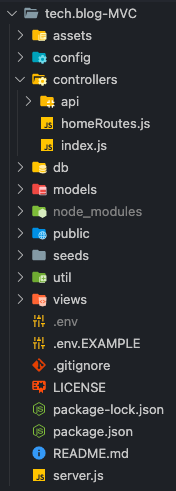

# TECH BLOG - MVC paradigm  

## Table of Contents

****

## Project overview

A tech blog featuring the Model-View-Controller paradigm using Handlebars and Sequelize.

### Project Status:

*ONGOING*

#### Issues to debug:

*  SQL randomizing user-seeds everytime `npm run seed`

* `Uncaught TypeError: Cannot read property 'addEventListener' of null for several scripts :: **RESOLVED**

* Log In button on modal not functioning: frontend JS

* Create post button not functioning: frontend JS ::  **RESOLVED**

* 400 @ `comment.js` line 13 for POST request

****

## MVP

### Project-build Aspects:

The following components are used to build the code for this project:

BACKEND: 
1. Handlebar.js: to handle templating language
2. Sequelize: to handle Object-relational Mapping
3. NPM packages:
    - express-session
    - dotenv
    - bcrypt
    - connect-session-sequelize

FRONTEND:
1. CSS
2. JavaScript 

### Functionality:

The following lists all functions within this project:

*
*
*

### Process:
#### Tasks

### Beyond the MVP

****

## Installation

1. Clone this repository onto local workspace
2. Open Terminal (MacOS) or Git Bash (Windows) and change location to where you want the cloned directory
3. Type `git clone` and paste copied respository
4. Directory should include the following:

## Usage

## Application Screenshots

****

## Deployment

****

## License

This application is licensed under the MIT license - please refer to the included `LICENSE` file in this repo.

## Credit

* Full-stack Bootcamp Program @ [Washington University, Saint Louis](https://bootcamp.tlcenter.wustl.edu/) through [© 2021 Trilogy Education Services, LLC, a 2U, Inc. brand](https://www.trilogyed.com/)